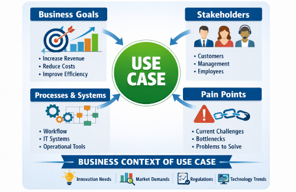

<!--
Copyright(c) 2026 Contributors to the Eclipse Foundation

See the NOTICE file(s) distributed with this work for additional
information regarding copyright ownership.

This work is made available under the terms of the
Creative Commons Attribution 4.0 International (CC-BY-4.0) license,
which is available at
https://creativecommons.org/licenses/by/4.0/legalcode.

SPDX-License-Identifier: CC-BY-4.0
-->

<!-- 
KIT LOGO START - Generated automatically from the configuration done in Kit Master Data
Replace <kit-id> with the id from your kit referenced in `data/kitsData.js`.
Do not remove!
This logo is only visible when compiled with Docusarus (final version of the hosted KIT)
-->

import Kit3DLogo from '@site/src/components/2.0/Kit3DLogo';

<Kit3DLogo kitId="engineering-mbse" />

<!--
KIT LOGO END
-->

## Introduction

<!-- Describe what problem this KIT solves and who benefits from it. -->

> TODO: Provide a short description of the KIT's purpose and scope.

**Model-Based Systems Engineering (MBSE)** is a engineering approach for the realization of complex systems that places **models** — rather than documents — at the center. Instead of
describing a system primarily through text-based specifications, drawings, and paper documents, MBSE uses formal, structured, and machine-readable models as the primary source of truth for capturing, analyzing, and communicating a system's requirements, architecture, behavior, and
structure throughout its entire lifecycle.

Usually this is applied by internal development teams. With the rising complexity in the stakeholder collaboration MBSE might also help in supporting the collaborative engineering. This KIT is meant to support in understanding where MBSE can be useful in Collaborative Engineering in Data Ecosystems and where not.

## Vision and Mission

<!-- What is the long-term goal? What does the KIT deliver today? Problem statatement -->

## Vision

When multiple organizations — OEMs, suppliers, and engineering partners — collaborate on a complex system, they must exchange and align requirements, architectures, and interfaces across organizational boundaries. Today, this collaboration is hampered by heterogeneous tools, inconsistent terminology, and incompatible data formats. Each partner maintains its own models and documents, making it difficult to establish a shared understanding of the system and to
trace decisions across the entire value chain.

Additionally, in the engineering phase there is often a complex dependency between multiple system elements that compose to an integrated system (e.g. a vehicle being an aggregation of different subsystems such as entertainment system and drive system which again can also be decomposed into subsystems across the data ecosystem). These system elements can be scattered across the data ecosystem making it even harder to take system wide decisions such as engineering changes.

:::info[Vision]
Our vision is an **common, system-focused, model-based foundation for collaborative engineering in data
ecosystems**. With this foundation system development can happen in data-sovereign and still integrated ways
:::

## Mission

The mission of this KIT is to **equip the different stakeholders of a data ecosystem with the data models, architectures, procedures, and terms they need to realize complex systems collaboratively**. It delivers a practical, actionable foundation that organizations can adopt to move from document-based, fragmented cross-company collaboration toward a shared, model-based way of working.

Concretely, the KIT provides:

- **Guidance for stakeholders** -- clear explanations of the roles involved in collaborative engineering and how each of them contributes to and benefits from the data ecosystem wide application of a model-based systems engineering approach.
- **Standardized artifacts** -- data models and reference architectures that partners can directly use to structure and exchange their relevant system engineering information.
- **Procedures and best practices** -- guidance on how to establish and operate model-based collaboration across company boundaries.
- **Use Case Explanations** -- Supporting in the differentiation where to apply and where not to apply MBSE in collaborative Engineering approaches in data ecosystems.
- **A shared terminology** -- a common glossary explaining the core and terms of MBSE allowing a better understanding for the usability in data ecosystems.

In doing so, the KIT makes it possible for organizations to collaborate on complex systems in a data ecosystem without each partner having to reinvent its own approach — enabling faster, more consistent, and more traceable cross-company systems engineering.

:::info[Mission]
Mission of the MBSE KIT is making the **application of MBSE in collaborative engineering cases** understandble in sense of requirements and possibilities. Additionally, it shall link the various KIT relevant for MBSE so that it is **integrating all relevant aspects for system realization in data ecosystem**.
:::

## Business Context

<!-- Describe the business process or domain this KIT addresses. If a use case describe the use case. -->

While usually MBSE focuses on the architectural realization of 
This KIT focuses on system realization in a complex ecosystem where systems 

In that way, MBSE links:

- [Requirements KIT](../../requirements-kit/adoption-view.md)
- [Engineering Simulation KIT](../../engineering-simulation-kit/adoption-view/adoption-view.md)

Additionally, which is not defined as an own KIT but of utmost importance is the Digital Engineering Master Data (DEMD)




> TODO: Describe the relevant business context and stakeholders.
> We recommend diagrams in drawio (need to be stored in SVG), or you can use mermaid or plant uml
> As described in TRG 1.04: https://eclipse-tractusx.github.io/docs/release/trg-1/trg-1-04
> You can also include infografics/ images (which are not diagrams, like above)

## Business Value

<!-- Describe why this KIT is attractive for service providers to be implemented -->

> TODO: Describe the business value of this KIT and why it should be implemented

## Semantic Models / Data Model

<!-- Reference the relevant semantic models, APIs, or standards. -->

Some of the relevant relevant data models are currently still under development

> TODO: Link or describe the data model, when using big payloads or json-schemas use expandable sections like below:

<details>
  <summary>Semantic Model Example - click to expand</summary>

Place here the description of your semantic model.

```json
{
  "key": "value",
  "object": {...},
  "array": [...]
}
```

</details>

## Standards

<!-- Provide a list of standards this KIT. -->

> TODO: Add the standards or external documetantion

| Name | Description | Link to standard |
| ---- | ----------- | ---------------------- |
| `CX-160` | This protocol is important when doing the data exchange | [example-link](https://cx-example.com) |
| `FX-XXXX` | This protocol is important when doing a vertical integration with shop floor machinery | [example-link](https://fx-example.com) |
| `ISO XXXX:XXXX` | This protocol is used as | [example-link](https://iso-example.com) |

## NOTICE

This work is licensed under the [CC-BY-4.0](https://creativecommons.org/licenses/by/4.0/legalcode).

- SPDX-License-Identifier: CC-BY-4.0
- SPDX-FileCopyrightText: 2026 Fraunhofer-Gesellschaft zur Foerderung der angewandten Forschung e.V. (represented by Fraunhofer IPK)
- SPDX-FileCopyrightText: 2026 Mercedes-Benz
- SPDX-FileCopyrightText: 2026 Contributors to the Eclipse Foundation
- Source URL: [https://github.com/eclipse-tractusx/eclipse-tractusx.github.io](https://github.com/eclipse-tractusx/eclipse-tractusx.github.io)
