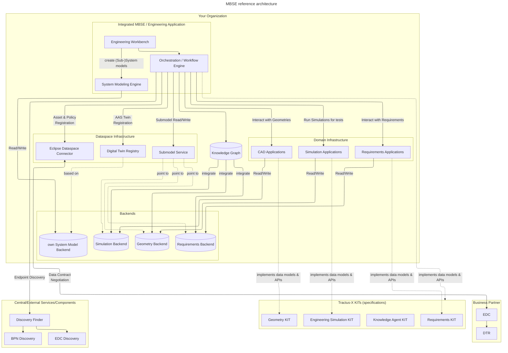
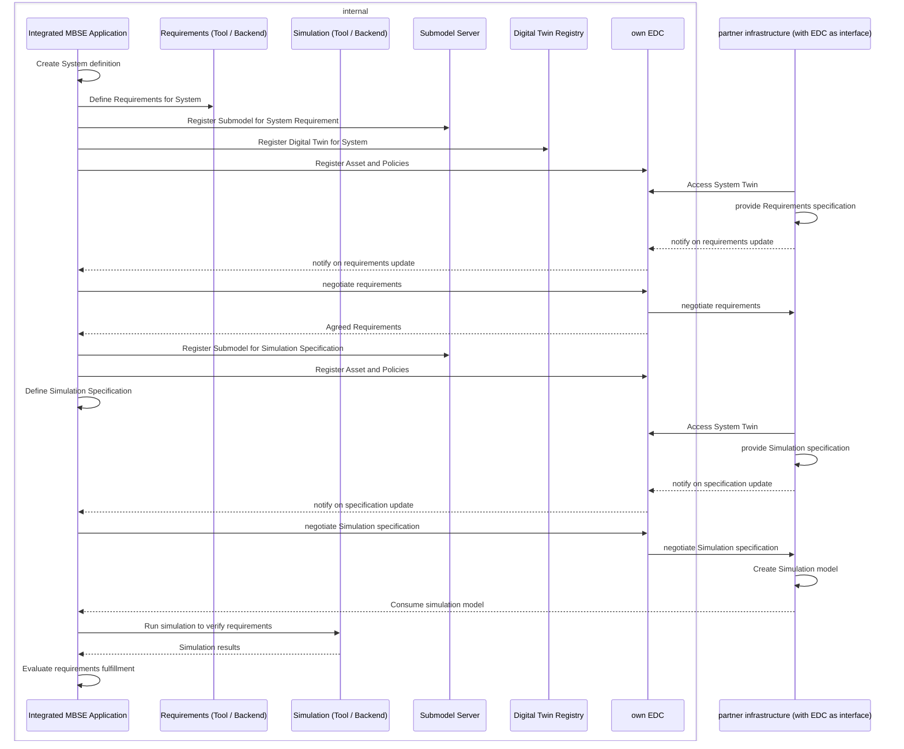

<!--
Copyright(c) 2026 Contributors to the Eclipse Foundation

See the NOTICE file(s) distributed with this work for additional
information regarding copyright ownership.

This work is made available under the terms of the
Creative Commons Attribution 4.0 International (CC-BY-4.0) license,
which is available at
https://creativecommons.org/licenses/by/4.0/legalcode.

SPDX-License-Identifier: CC-BY-4.0
-->

<!-- 
KIT LOGO START - Generated automatically from the configuration done in Kit Master Data
Replace <kit-id> with the id from your kit referenced in `data/kitsData.js`.
Do not remove!
This logo is only visible when compiled with Docusarus (final version of the hosted KIT)
-->

import Kit3DLogo from '@site/src/components/2.0/Kit3DLogo';

<Kit3DLogo kitId="engineering-mbse" />

<!--
KIT LOGO END
-->

:::info[Target Audience] 
Software Developers, Solution Architects, Technical Leads, API Developers, Integration Engineers. 
:::

## Architecture Overview

Model Based Systems Engineering is an approach that bridges the gap between different domains, making it a *transdisciplinary approach for system realization*. In the same way, the architecture for the technical realization of MBSE in Collaborative Engineering environments in data ecosystems has to be integrative rather than a standalone solution.

The MBSE KIT therefore does not define a single monolithic application. Instead, it describes how an **integrated MBSE / engineering application** can be built by implementing and consuming the specifications of several Catena-X KITs.

The following diagram shows the high-level architecture of an integrated MBSE application. It implements the data models and calls the APIs specified by the referenced KITs, and it exchanges data through the common Catena-X infrastructure (EDC, Digital Twin Registry, Submodel Service).

:::note
For a similar approach the [Industry Core Hub](https://eclipse-tractusx.github.io/industry-core-hub/) can be considered as a feasible solution to integrate different Tractus-X Components and KIT implementations.
:::

The KITs define specifications for Orchestrator as well as for the actual application (e.g. for Requirements Engineering by setting a ReqIF based data model). In that way, the Orchestrator can easily interact internally with the applications as well as with external applications through an EDC.

The approach is as follows:

- The Engineering application has an UI to an orchestrator
- The application does not integrate domain specific tasks itself but outsources them to the domain-specific applications through an orchestrator
- baseline are the system models - for each system and subsystem a model is created and for systems with a collaborative engineering approach linked to  Digital Twins in the DTR. The registration is done through the Orchestrator
- For providing and consuming external data the Orchestrator can access the EDC (either with knowledge-agent extension or not) and do contract negotiations
- The submodel service points to the actual backend systems of the domain applications to avoid duplication of data. If not directly implemented in the backend an abstraction layer can be put between the backend and the submodel service to only allow access to permitted data.

:::note[KA integration]
While this reference already mentions Knowledge Graphs and Agents it is not yet implemented.
This would require to register the data in a different way for the ecosystem.
For further details see the [Analysis of the Knowledge Agent KIT for Engineering](../documentation/knowledge-agent-engineering.md)
:::

### What the KITs Specify

Each referenced KIT contributes a distinct specification to an integrated MBSE application:

| KIT | What it specifies for the integrated MBSE application |
| --- | --------------------------------------- |
| [Requirements KIT](../../requirements-kit/adoption-view.md) | The data model and APIs for managing requirements, their structure, and traceability across partners. Provides the requirements against which the system of interested is developed and later on verified. |
| Engineering Simulation KIT (under development) | The data model and APIs for specifying simulation models. It does not focus on the exchange or execution itself but only on the description of the simulation models. |
| [Geometry KIT](../../geometry-kit/adoption-view.md) | The data model and APIs for geometric data (CAD/STEP) to check the geometrical realization of the system against its geometrical requirements. |

## Reference Workflow

To illustrate how an integrated application can support MBSE in a collaborative Engineering environment, the following sequence diagram shows a representative **requirements-fulfillment check**: the engineering application gathers the relevant data via the Knowledge Agent KIT specification, verifies the system against its requirements using the Engineering Simulation KIT specification, and optionally checks the geometrical realization with the Geometry KIT specification.

This sequence integrated both System definition and Requirement Engineering based on the [Requirements KIT](../../requirements-kit/adoption-view.md) as well as the specification, creation and consumption of a simulation model based on the Engineering Simulation KIT. This approach currently considers only a 1:1 relationship - the approach can be extended based on the number of involved consumers and suppliers.

:::info[Simulation Model exchange]
Currently the simulation model exchange is documented as direct access from the application.
This is done because the simulation models are usually very large (GB to TB) and are either in blob storages or in external systems.
As long as there is no standard defining the exchange, this should be directly handled by the application depending on the kind of simulation.
:::

## Application Programming Interfaces (API)

MBSE is not a single domain, but a transdisciplinary approach. Thus there are no tools that can solve every in one application. In the same way there should be no API only for MBSE, but applications for MBSE should use the APIs of the domain-specific applications Therefore, for specific APIs, the KITs should be considered:

- [Requirements KIT — Software Development View](../../requirements-kit/software-development-view.md)
- [Geometry KIT — Software Development View](../../geometry-kit/software-development-view.md)
- [Knowledge Agent KIT — Software Development View](../../knowledge-agents-kit/software-development-view/api.md)
- Simulation KIT

## Protocols

The integrated application relies on the protocols provided by the underlying Catena-X infrastructure and the referenced KITs. The following protocols are used for the data exchange:

| Name | Description | Link to Documentation |
| ---- | ----------- | ---------------------- |
| Data Space Protocol (DSP) | Secure, sovereign data exchange between partners for all data flows | [Connector KIT](../../connector-kit/adoption-view) |
| Digital Twin Registry (DTR) | Registration and discovery of digital twins and their submodels | [Digital Twin KIT](../../digital-twin-kit/adoption-view) |

## NOTICE

This work is licensed under the [CC-BY-4.0](https://creativecommons.org/licenses/by/4.0/legalcode).

- SPDX-License-Identifier: CC-BY-4.0
- SPDX-FileCopyrightText: 2026 Fraunhofer-Gesellschaft zur Foerderung der angewandten Forschung e.V. (represented by Fraunhofer IPK)
- SPDX-FileCopyrightText: 2026 Mercedes-Benz
- SPDX-FileCopyrightText: 2026 Contributors to the Eclipse Foundation
- Source URL: [https://github.com/eclipse-tractusx/eclipse-tractusx.github.io](https://github.com/eclipse-tractusx/eclipse-tractusx.github.io)
