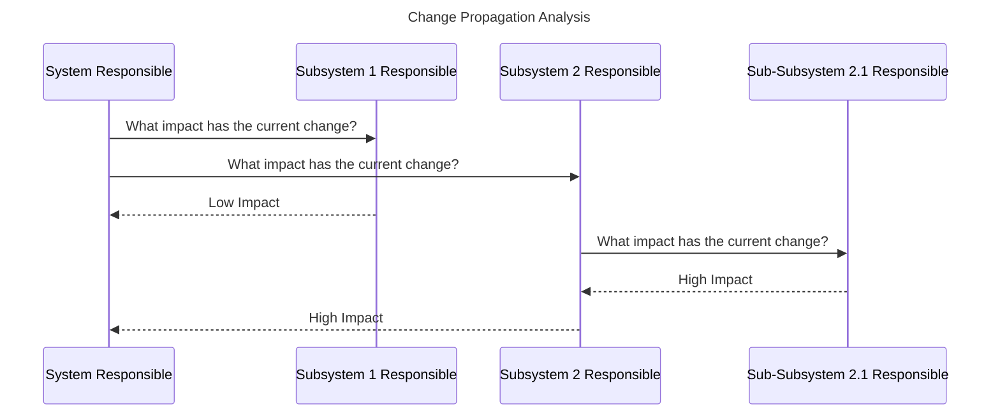

The [Knowledge Agent KIT](https://eclipse-tractusx.github.io/docs-kits/kits/knowledge-agents-kit/adoption-view/intro) specifies a semantically-driven, compute-to-data architecture for federated queries over the data space. Instead of exchanging static data assets, participants register *queries* against knowledge graphs and let agents retrieve, combine, and compute the requested information across the network. The KIT explains the underlying concepts — knowledge graphs, skills, roles, and the technical components — in detail.

This page focuses on the question: **how can Knowledge Agents be used in Model-Based Systems Engineering (MBSE)** in a cross-company data ecosystem?

## Why Knowledge Agents fit MBSE

In cross-company MBSE, the relevant information is rarely a single static asset. It is spread across all involved partners and sub-systems, it changes as the system evolves, and it must often be evaluated in combination. Knowledge Agents address exactly these characteristics:

- **It is not known in advance what is available** — the data catalog and the assets themselves must be crawled and explored before a query can be formulated.
- **Crawling across the full network is required** — e.g. in a multi-partner collaboration with a large number of assets distributed across many participants.
- **The assets are dynamic and change rapidly** — so a static, pre-registered asset would quickly become outdated.

The last point is especially common in engineering scenarios, where all partners involved in the engineering of a system continuously adapt their sub-systems in response to external influences on their system boundaries.

## MBSE use cases for Knowledge Agents

Specific engineering use cases where Knowledge Agents add value are:

- **Early realizations** — where only the sub-system boundary to be addressed by another participant is defined, e.g. a supplier is responsible for the *entertainment system* without the physical layer being defined yet. The supplier can be queried directly for the relevant knowledge without a fully specified asset.
- **Overall requirements fulfillment** — when a full set of information separated across all involved sub-systems and partners is needed, e.g. evaluating the overall requirements fulfillment of a system during integration.
- **Change propagation analysis** — analysis that requires evaluating the detailed knowledge of each partner in the network to determine the impact of a change across system boundaries.
- **Geometry analysis** — querying and combining geometric information across partners.
- **Baseline / status evaluation (DTR)** — representing data in a given context and evaluating the status (baseline): *what information do I have about the system at a specific point in time* — potentially also in the past.

### Example: Change Propagation Analysis

The following sequence diagram illustrates how a change-propagation analysis can be performed across a system and its sub-systems using the Knowledge Agent approach:

The system responsible queries each sub-system responsible for the impact of a change. Sub-system 2 in turn queries its own sub-sub-system, aggregates the result, and reports the combined impact back to the system level. This distributed, query-driven evaluation is a natural fit for the Knowledge Agent approach.

## Roles in the MBSE context

The [Knowledge Agent KIT](https://eclipse-tractusx.github.io/docs-kits/kits/knowledge-agents-kit/adoption-view/intro) defines a set of roles for the agent ecosystem. In an MBSE context, these roles map onto the engineering partners as follows:

| Role | MBSE example |
| ---- | ------------ |
| **Data Provider** | An OEM providing system models and requirements as knowledge. |
| **Function Provider** | A Tier-1 supplier providing proprietary engineering functions (e.g. simulation or analysis services). |
| **Skill Provider** | A partner providing compute resources and procedural logic for engineering analyses. |
| **Core Service Provider** | An operating company offering ontology models or a federated catalogue for the engineering domain. |
| **Data Consumer** | A partner that wants to use engineering data and logic via agent technology. |

## Current issues and limitations for MBSE

While the concept is promising, the current technical implementation of the Knowledge Agent KIT has significant issues that must be addressed before it can be used productively in MBSE:

- The [Knowledge Agent KIT](https://eclipse-tractusx.github.io/docs-kits/kits/knowledge-agents-kit/adoption-view/intro) is based on approaches and technical components that have **not been updated since 2023** (e.g. it is built on EDC version 0.7.x, while the current EDC version is 0.12).
- The KIT requires assets defined as [Graph Assets or Skill assets](https://eclipse-tractusx.github.io/docs-kits/kits/knowledge-agents-kit/software-development-view/modules#data-plane), which are **not compliant with the Industry Core applications** and further refinements in data modeling. There exist bridges, but these also have issues.
- The submodels defined in engineering are **not directly usable** in the Knowledge Agent approach, as it uses ontologies to describe assets instead of submodels. It is also not directly using AAS and conflicts partly with CX-0002.
- There is currently **no productive use case** that builds on the skill approach. While it offers great potential (e.g. offering a skill to query all requirements related to a component), it is not widely tested under current conditions.
- The KIT is currently **not actively maintained** — no expert group or committee is actively addressing a use case, and the components are not being updated.
