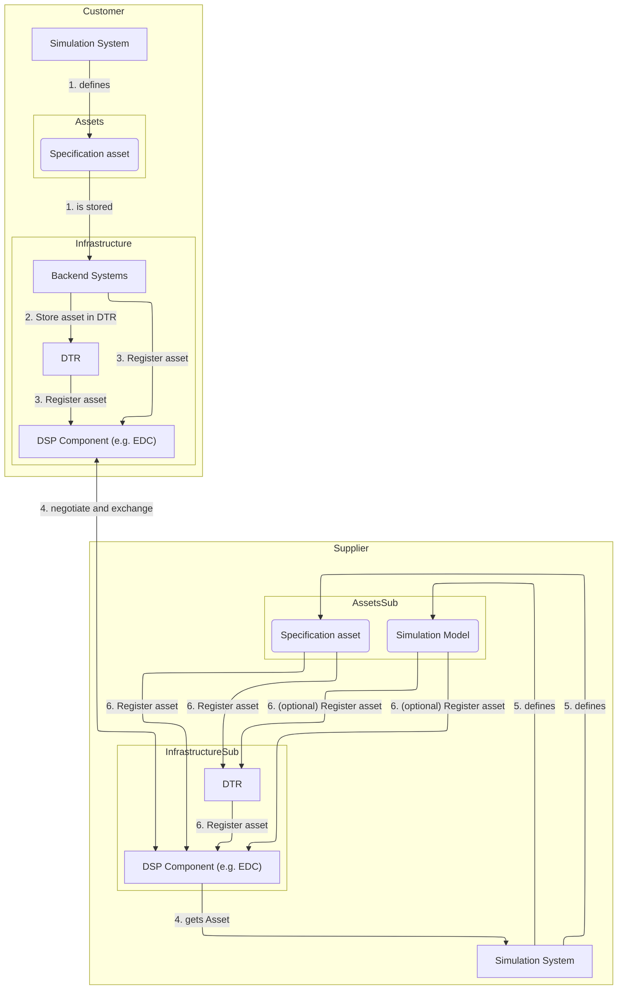
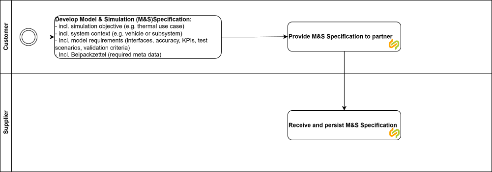
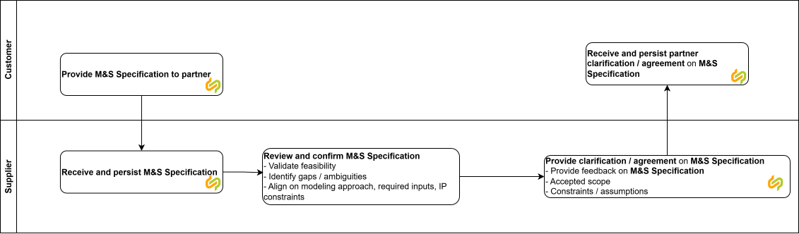
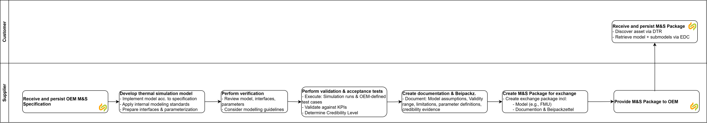

<!--
Copyright(c) 2026 Contributors to the Eclipse Foundation

See the NOTICE file(s) distributed with this work for additional
information regarding copyright ownership.

This work is made available under the terms of the
Creative Commons Attribution 4.0 International (CC-BY-4.0) license,
which is available at
https://creativecommons.org/licenses/by/4.0/legalcode.

SPDX-License-Identifier: CC-BY-4.0
-->

<!-- 
KIT LOGO START - Generated automatically from the configuration done in Kit Master Data
Replace <kit-id> with the id from your kit referenced in `data/kitsData.js`.
Do not remove!
This logo is only visible when compiled with Docusarus (final version of the hosted KIT)
-->

import Kit3DLogo from '@site/src/components/2.0/Kit3DLogo';

<Kit3DLogo kitId="engineering-simulation" />

<!--
KIT LOGO END
-->

## Architecture Overview

<!-- High-level diagram of the technical approach. -->

The diagrams shows involved systems.
Both sides need DSP conformant connectors as for example the EDC.
The register there the specification, that can be directly driven by Solution providers.
The answer to the request is also done through the DSP connector a model is created and aligned. In the following, the Phases of the adoption view shall be better explained.

### Detailed Phases

In the business context the overall phases where already presented. To develop fitting solutions the following detail level shall be considered for the different phases (wih a Catena-X label for the actual exchange in the network):

#### Phase A: Specification / Definition

In this phase, the actual definition of the specification is done.
Depending on the [Use Case](../adoption-view/adoption-view.md#use-casses) the SIC-core base specification is used with a specific profile. Usually relevant in that phase are:

- model scope / purpose
- acceptance criterial
- physical boundary conditions

#### Phase B: Confirmation

This step includes the review and answer to the specification. It can be somehow compared to the Requirements Engineering approach.
The required parameter need to be defined here as well.

#### Phase C: Agreement / Release

Depending on the feedback in the previous step, there need to be some alignment steps between customer and supplier that need to be resolved. After that, the specification can be released. Especially important is to lock the release for further validation and verification steps. The same data as in Step A is used here.

#### Phase D: Provisioning

Thi steps is currently not directly addressed by the KIT.
It focuses on the development until actual provisioning of the simulation  model.

#### Phase E + F: Feedback and Enhancement

Finally, the feedback has to be aggregated and the model has to be enhanced. After these topics are resolved, the actual model transfer can happen

## Protocols

| Name | Description | Link to Documentation |
| ---- | ----------- | --------------------- |
| `Data Space Protocol` | Main protocol for exchange in data ecosystems | [Eclipse DSP](https://eclipse-dataspace-protocol-base.github.io/DataspaceProtocol/HEAD/) |

## NOTICE

This work is licensed under the [CC-BY-4.0](https://creativecommons.org/licenses/by/4.0/legalcode).

- SPDX-License-Identifier: CC-BY-4.0
- SPDX-FileCopyrightText: 2026 Fraunhofer-Gesellschaft zur Foerderung der angewandten Forschung e.V. (represented by Fraunhofer IPK)
- SPDX-FileCopyrightText: 2026 Schaeffler AG
- SPDX-FileCopyrightText: 2026 Mercedes-Benz
- SPDX-FileCopyrightText: 2026 German Aerospace Center (DLR)
- SPDX-FileCopyrightText: 2026 Robert Bosch GmbH
- SPDX-FileCopyrightText: 2026 Dräxlmaier GmbH & Co. KG
- SPDX-FileCopyrightText: 2026 Contributors to the Eclipse Foundation
- Source URL: [https://github.com/eclipse-tractusx/eclipse-tractusx.github.io](https://github.com/eclipse-tractusx/eclipse-tractusx.github.io)
