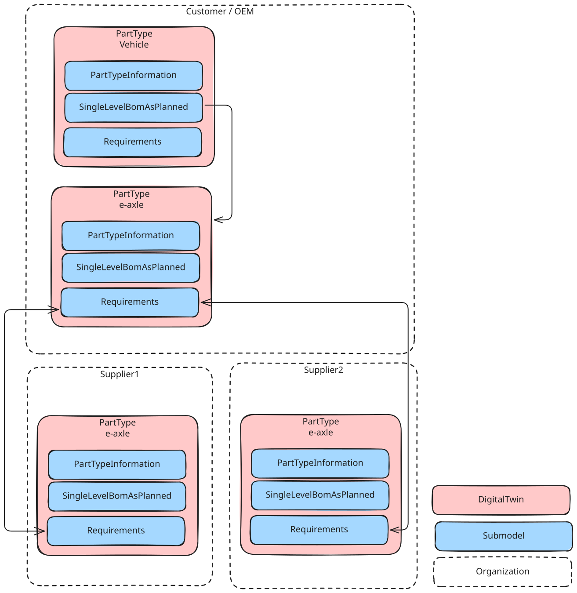
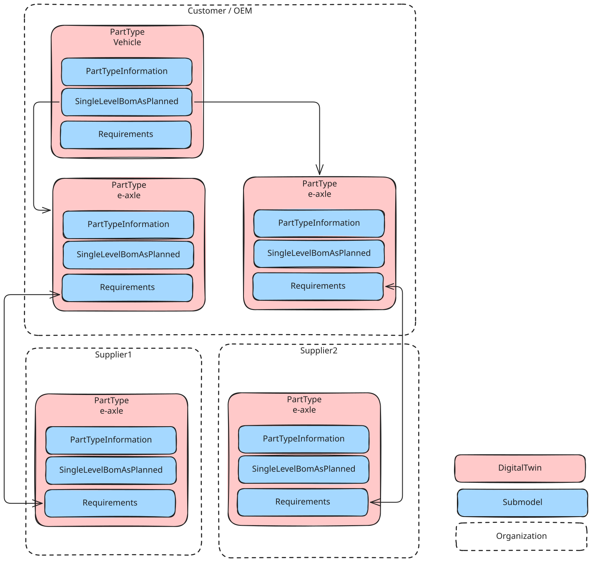

<!--
Copyright(c) 2026 Contributors to the Eclipse Foundation

See the NOTICE file(s) distributed with this work for additional
information regarding copyright ownership.

This work is made available under the terms of the
Creative Commons Attribution 4.0 International (CC-BY-4.0) license,
which is available at
https://creativecommons.org/licenses/by/4.0/legalcode.

SPDX-License-Identifier: CC-BY-4.0
-->

<!-- 
KIT LOGO START - Generated automatically from the configuration done in Kit Master Data
Replace <kit-id> with the id from your kit referenced in `data/kitsData.js`.
Do not remove!
This logo is only visible when compiled with Docusarus (final version of the hosted KIT)
-->

import Kit3DLogo from '@site/src/components/2.0/Kit3DLogo';

<Kit3DLogo kitId="requirements" />

<!--
KIT LOGO END
-->

Data Ecosystems such as Catena-X or Aerospace-X rely on the principle of [Digital Twins](../../digital-twin-kit/adoption-view) mainly addressed by the [Asset Administration Shell (AAS)](../../digital-twin-kit/software-development-view/software-development-view.md#asset-administration-shell). This gives a structured approach using  [Submodels](../../digital-twin-kit/software-development-view/software-development-view.md#submodels) to provide relevant data to an asset. Each asset is describes as either a 

- ``PartType`` for CatalogParts or 
- ``PartInstance`` for Batches, Just in Sequence Parts or Serializes Parts. 

more details be seen in the [Industry Core KIT](../../industry-core-kit/adoption-view.mdx#asplanned).

In Engineering there is an additional case where there is no serialization of a Part (requirement for ``PartInstance``)  yet and there is even no supplier selected for a Part (requirement for ``PartType``). _Intended Realization_ might be shared e.g. in the [Requirements Engineering](../adoption-view/adoption-view.md) process.

## Multiple Digital Twins for same asset

Consider the following scenario:

- An OEM wants to build a new car that shall have an eaxle system included.
- A ``PartType`` Twin of the Vehicle is created, including the CatalogPart information (such as the )
- A ``PartType`` Twin of the eAxle is created and linked in the ``SingleLevelBomAsPlanned`` 
- Requirements are added to it the ``PartType``  twin of the eaxle and shared with 2 partners, that could potentially be a supplier for the eaxle and the [Requirements Engineering process](../adoption-view/adoption-view.md#core-business-process--user-journey) is started 

This is shown in the following figure.

The issue is, that both Customer and Supplier update the status in the Requirements Engineering process. While this is no problem on supplier side, on customer side it generated conflicts at least in the date of agreement.

For that purpose, a Digital Twin per supplier is required. This requires updating on the OEM side, the alignment in the ecosystem is solved - in the realization, only the Twin of the selected supplier is kept in the full ``PartType`` twin. Until then, both ``PartType`` twins are included in the `` SingleLevelBomAsPlanned`` as it states 

> _"In as planned lifecycle state all variants are covered ("120% BoM"). If multiple versions of child parts exist that can be assembled into the same parent part, all versions of the child part are included in the BoM. If there are multiple suppliers for the same child part, each supplier has an entry for their child part in the BoM."_  (see [Industry Core KIT: SingleLevelBomAsPlanned](../../industry-core-kit/software-development-view/aspect-models.mdx#singlelevelbomasplanned))

## NOTICE

This work is licensed under the [CC-BY-4.0](https://creativecommons.org/licenses/by/4.0/legalcode).

- SPDX-License-Identifier: CC-BY-4.0
- SPDX-FileCopyrightText: 2026 Fraunhofer-Gesellschaft zur Foerderung der angewandten Forschung e.V. (represented by Fraunhofer IPK)
- SPDX-FileCopyrightText: 2026 Schaeffler AG
- SPDX-FileCopyrightText: 2026 Mercedes-Benz
- SPDX-FileCopyrightText: 2026 German Aerospace Center (DLR)
- SPDX-FileCopyrightText: 2026 Robert Bosch GmbH
- SPDX-FileCopyrightText: 2026 Dräxlmaier GmbH & Co. KG
- SPDX-FileCopyrightText: 2026 Contributors to the Eclipse Foundation
- Source URL: [https://github.com/eclipse-tractusx/eclipse-tractusx.github.io](https://github.com/eclipse-tractusx/eclipse-tractusx.github.io)